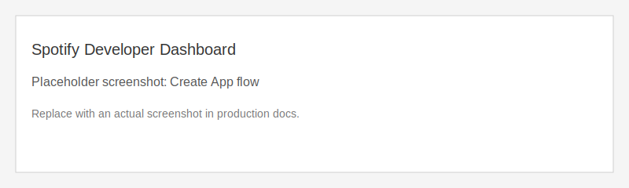
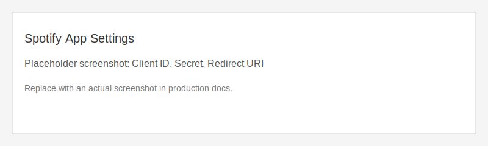
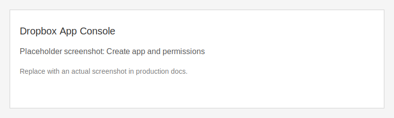

# Setup Guide

This guide walks you through setting up spotifyPlaylistBackups for local usage or development.

## Prerequisites

- Python 3.10 or higher
- pip (Python package installer)
- git

## Installation

### 1. Clone the Repository

```bash
git clone https://github.com/amendez13/spotifyPlaylistBackups.git
cd spotifyPlaylistBackups
```

### 2. Create Virtual Environment

```bash
python3 -m venv venv

# Activate virtual environment
source venv/bin/activate  # On macOS/Linux
# venv\Scripts\activate   # On Windows
```

### 3. Install Dependencies

```bash
# Install production dependencies
pip install -r requirements.txt

# Install development dependencies (optional)
pip install -r requirements-dev.txt
```

## Create Spotify API App

1. Visit the Spotify Developer Dashboard: https://developer.spotify.com/dashboard
2. Create a new app and give it a name/description.
3. Open the app settings and add a redirect URI:
   - `http://localhost:8888/callback`
4. Copy the Client ID and Client Secret for `config/config.yaml`.




## Create Dropbox API App

1. Visit the Dropbox App Console: https://www.dropbox.com/developers/apps
2. Create a new app with Scoped access.
3. Choose **App folder** access to keep backups in `/Apps/<app-name>`.
4. In **Permissions**, enable:
   - `files.content.read`
   - `files.content.write`
5. Copy the App Key and App Secret for `config/config.yaml`.




## Configure the Application

### 1. Create the Config File

```bash
cp config/config.example.yaml config/config.yaml
```

### 2. Update Config Values

```yaml
spotify:
  client_id: REPLACE_WITH_SPOTIFY_CLIENT_ID
  client_secret: REPLACE_WITH_SPOTIFY_CLIENT_SECRET
  redirect_uri: http://localhost:8888/callback

dropbox:
  app_key: REPLACE_WITH_DROPBOX_APP_KEY
  app_secret: REPLACE_WITH_DROPBOX_APP_SECRET
  # refresh_token: REPLACE_WITH_DROPBOX_REFRESH_TOKEN

backup:
  folder: /spotify-backups
  csv_delimiter: ","

tokens:
  storage_path: .spotify_token.json
```

### 3. Authenticate

```bash
# Spotify OAuth
python -m src.main auth spotify

# Dropbox OAuth (stores refresh token in config/config.yaml)
python -m src.main auth dropbox
```

## Environment Variables

You can override the YAML config with environment variables:

| Variable | Description | Default |
|----------|-------------|---------|
| `SPOTIFY_CLIENT_ID` | Spotify client ID | required |
| `SPOTIFY_CLIENT_SECRET` | Spotify client secret | required |
| `SPOTIFY_REDIRECT_URI` | Spotify redirect URI | `http://localhost:8888/callback` |
| `DROPBOX_APP_KEY` | Dropbox app key | required |
| `DROPBOX_APP_SECRET` | Dropbox app secret | required |
| `DROPBOX_REFRESH_TOKEN` | Dropbox refresh token | empty |
| `BACKUP_FOLDER` | Remote backup folder | `/spotify-backups` |
| `CSV_DELIMITER` | CSV delimiter | `,` |
| `TOKEN_STORAGE_PATH` | Token cache path | `.spotify_token.json` |
| `SPOTIFY_BACKUPS_CONFIG_PATH` | Path to config YAML | `config/config.yaml` |

## Verify Installation

```bash
python -m src.main --help
python -m src.main list
```

## Notes

- The images in this guide are placeholders to indicate where screenshots belong.
- See `docs/CONFIG.md` for a full configuration reference.

## Troubleshooting

**Virtual environment not activated**
```bash
source venv/bin/activate
```

**Dependencies not installed**
```bash
pip install -r requirements.txt
```

**Configuration file not found**
```bash
cp config/config.example.yaml config/config.yaml
```

**Dropbox refresh token missing**
```bash
python -m src.main auth dropbox
```

## Getting Help

- Check the [Documentation Index](INDEX.md)
- Review [CI documentation](CI.md) for testing issues
- Open an issue on GitHub
